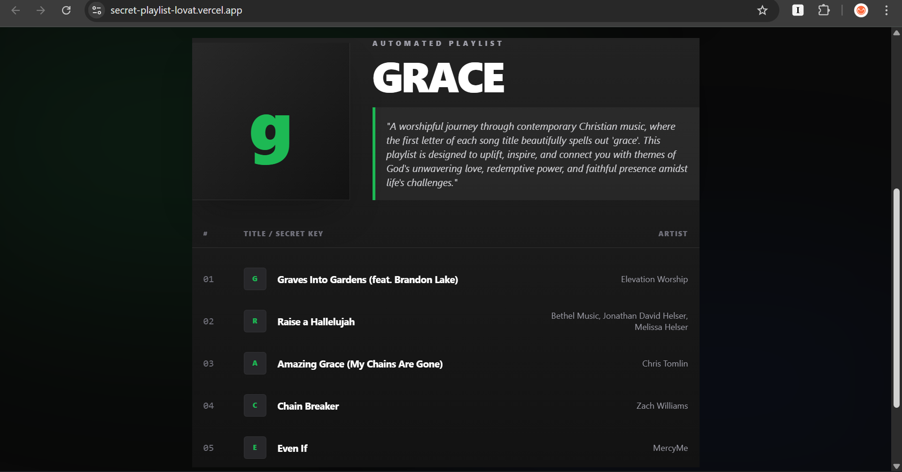

# 🎵 Vibe_Architect


**A Next.js 16 + Gemini-powered playlist generator that hides secret messages in your music.**

[](https://vercel.com)

Vibe_Architect is a high-end web utility that uses Google's Gemini 3 Flash model to procedurally generate music playlists. Each playlist is an acrostic—the first letter of every song title spells out a hidden message of your choice, all while maintaining a specific sonic "vibe."

---

## ✨ Features

- **AI-Driven Acrostics:** Uses LLM logic to solve the constraint puzzle of song titles matching specific letters and genres simultaneously.
- **Spotify-Inspired UI:** Built with **Tailwind CSS v4**, featuring glassmorphism, OKLCH color spaces, and mesh gradients.
- **Manifest Generation:** Export your playlist as a high-fidelity `.png` manifest using `html2canvas-pro`.
- **Live Search:** Every song in the manifest is deep-linked to a YouTube/Search query for instant listening.
- **Dynamic Model Discovery:** Resilient API logic that automatically detects and uses the best available Gemini model in your region.

---

## 🛠️ Tech Stack

- **Framework:** [Next.js 16 (App Router)](https://nextjs.org/)
- **AI Engine:** [Google Gemini 1.5 Flash / Pro](https://aistudio.google.com/)
- **Styling:** [Tailwind CSS v4](https://tailwindcss.com/)
- **Client-side Capture:** `html2canvas-pro`
- **Deployment:** [Vercel](https://vercel.com)

---

## 🚀 Getting Started

### 1. Prerequisites
- Node.js 20+ installed.
- A Google AI Studio API Key.

### 2. Installation
```bash
git clone [https://github.com/HermonaDev/secret-playlist.git](https://github.com/HermonaDev/secret-playlist.git)
cd secret-playlist
npm install